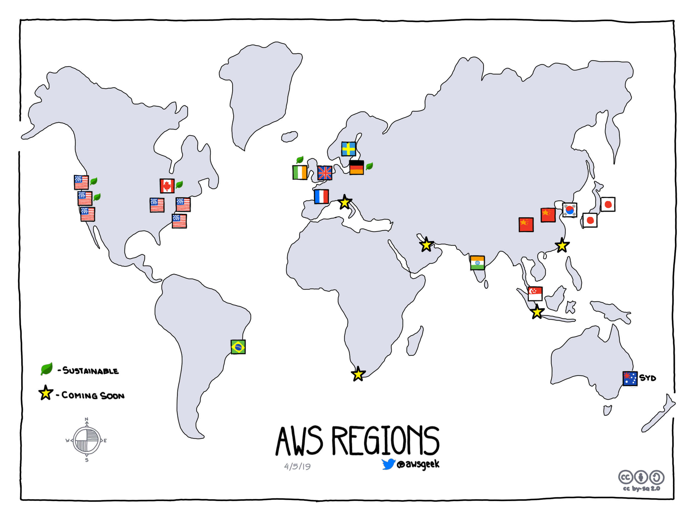

# Green Cost Explorer - climate related spend analysis for AWS
[](#contributors)

If you work in technology, it's reasonable to think that you have some respect for science.

And if you have some respect for science, then you'll understand why spending a significant of your monthly AWS bills on fossil fuel powered infrastructure isn't a thing we can afford to do anymore.

Because Amazon provide a helpful breakdown of which [regions you use run on what they refer to as sustainable power, and which ones do not][1], and [because they provide a cost-explorer tool][2], you combine this information to get an idea of where you might be spending money on fossil fuels without realising.

[1]: https://aws.amazon.com/about-aws/sustainability/
[2]: https://docs.aws.amazon.com/AWSJavaScriptSDK/latest/AWS/CostExplorer.html#getCostAndUsage-property

You can also just look at this nice cartoon. The ones which are notionally sustainable, have the green leaf next to them:



### What this does

TODO

- Sort your monthly spend into green vs grey spend
- Create a basic table showing this
- Show this as a chart
- Project forward, using AWS's cost projection features

### Usage

This is a wrapper around the AWS NodeJS SDK, and because of this, you need to set following environment variables to get results back:

```
AWS_ACCESS_KEY_ID='YOUR_KEY_ID'
AWS_SECRET_ACCESS_KEY='YOUR_SECRET_ACCESS_KEY'
```

Once you have this, call `greencost` to get an idea of your spend over the last year.

It looks for the AWS credentials in your environment, but if you're not comfortable with this, the [AWS SDK lets you pass in credentials][creds] in number of ways.

[creds]: https://docs.aws.amazon.com/sdk-for-javascript/v2/developer-guide/getting-started-nodejs.html

```
npx greencost
```

If all goes well (ahem, and [once the table output has actually been implemented…][issue-1]), you'll get something like this:

[issue-1]: https://github.com/thegreenwebfoundation/green-cost-explorer/issues/1

```
|          | Grey   | Green  |
-----------|--------|--------|
|Aug  2018 |  40%   |  60%   |
|Sept 2018 |  40%   |  60%   |
|Oct  2018 |  40%   |  60%   |
|Nov  2018 |  40%   |  60%   |
|Dec  2018 |  40%   |  60%   |

```

### Licensing

Feel free to use this commercially - part of your job as a professional in tech is to avoid unnecessary harm, and burning fossil fuels, objectively causes harm, and is totally avoidable, by either switching regions, or using a different provider.

It's all about tracking your own spend, so it's actually pretty hard to make this something you couldn't use to commercial use

So, Apache 2.0, yo.

## Contributors ✨

Thanks goes to these wonderful people ([emoji key](https://allcontributors.org/docs/en/emoji-key)):

<!-- ALL-CONTRIBUTORS-LIST:START - Do not remove or modify this section -->
<!-- prettier-ignore -->
<table>
  <tr>
    <td align="center"><a href="https://franka.tech"><br /><sub><b>Franka</b></sub></a><br /><a href="https://github.com/thegreenwebfoundation/green-cost-explorer/commits?author=vsmart" title="Code">💻</a></td>
  </tr>
</table>

<!-- ALL-CONTRIBUTORS-LIST:END -->

This project follows the [all-contributors](https://github.com/all-contributors/all-contributors) specification. Contributions of any kind welcome!